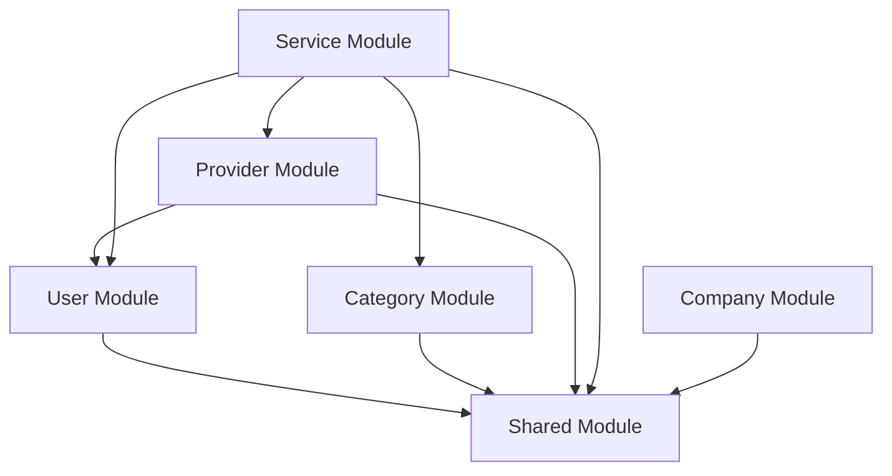

# Modular Monolith Architecture

This backend follows a **Modular Monolith** architecture pattern, which provides better organization, maintainability, and scalability compared to traditional layered architecture.

## Architecture Overview

### Traditional vs Modular Approach

**Before (Layered):**
```
src/
├── controllers/    # All controllers
├── services/       # All services  
├── routes/         # All routes
├── validators/     # All validators
└── middlewares/    # All middlewares
```

**After (Modular):**
```
src/
└── modules/
    ├── user/           # User domain
    ├── category/       # Category domain
    ├── provider/       # Provider domain
    ├── company/        # Company domain
    ├── service/        # Service domain
    └── shared/         # Shared components
```

## Module Structure

Each domain module follows a consistent structure:

```
modules/[domain]/
├── index.ts                # Module exports
├── types.ts               # Domain types & interfaces
├── [domain].controller.ts # HTTP request handling
├── [domain].service.ts    # Business logic
├── [domain].route.ts      # Route definitions
└── [domain].validator.ts  # Input validation schemas
```

### Shared Module

The shared module contains cross-cutting concerns:

```
modules/shared/
├── types/           # Common types & interfaces
├── errors/          # Domain error classes
├── middlewares/     # Reusable middlewares
├── utils/           # Utility functions
└── interfaces/      # Repository patterns
```

## Key Benefits

1. **Domain-Driven Design**: Code is organized by business domains rather than technical layers
2. **Better Separation of Concerns**: Each module handles its own domain logic
3. **Improved Maintainability**: Changes are localized to specific domains
4. **Enhanced Testability**: Modules can be tested in isolation
5. **Scalability**: Individual modules can be extracted into microservices if needed
6. **Clear Boundaries**: Well-defined interfaces between modules

## Design Patterns Used

### 1. Module Pattern
Each domain is encapsulated in its own module with clean exports.

### 2. Repository Pattern (Interface)
Data access is abstracted through repository interfaces in `shared/interfaces/`.

### 3. Domain Error Handling
Custom error classes provide better error handling and HTTP status mapping.

### 4. Dependency Injection Ready
Modules are designed to support dependency injection for better testability.

## Module Dependencies



## Usage Examples

### Importing from modules:
```typescript
// Import specific functions
import { userRoutes } from './modules/user/index.js';

// Import domain types
import { User, UserCreateData } from './modules/user/types.js';

// Import shared utilities
import { DomainError, ApiResponse } from './modules/shared/index.js';
```

### Adding new features:
1. Identify the appropriate domain module
2. Add business logic to the service file
3. Add HTTP handlers to the controller
4. Update routes and validation as needed
5. Export new functionality through module index

## Migration Benefits

- ✅ Cleaner codebase organization
- ✅ Better code discoverability
- ✅ Reduced coupling between domains
- ✅ Foundation for microservices migration
- ✅ Improved developer experience
- ✅ Better testing isolation

This architecture provides a solid foundation for scaling the application while maintaining clean separation of concerns and domain boundaries.